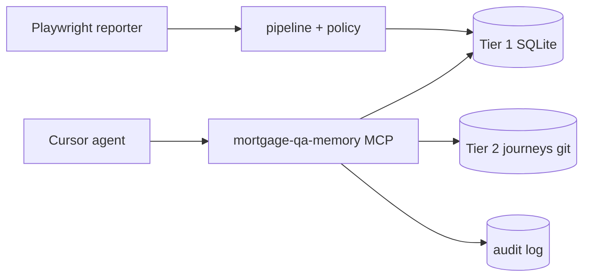

# Mortgage QA Memory MCP

Governed **Playwright QA memory** for Cursor agents — tiered retention, policy pre-save, mortgage compliance audit. Adapted from DoorDash and Salesforce agentic memory patterns.

**Status:** working POC/MVP in `packages/*`.

---

## Quickstart

```bash
npm install
npm run seed:demo
npm run smoke          # expect SMOKE PASS
npm run console        # http://127.0.0.1:4173
```

Point Cursor at [`cursor/mcp.json`](./cursor/mcp.json). Full package map: [docs/11-implementation.md](./docs/11-implementation.md).

---

## Documentation

All docs in **[docs/](./docs/README.md)** — single tree (design + implementation + security + adoption).

| Start here | Path |
|------------|------|
| **Another AI / new project** | [docs/00-adoption-guide.md](./docs/00-adoption-guide.md) |
| **Engineer** | [docs/11-implementation.md](./docs/11-implementation.md) |
| **Leadership / security** | [docs/18-official-mcp-packages-risk-brief.md](./docs/18-official-mcp-packages-risk-brief.md) |
| **Full index** | [docs/README.md](./docs/README.md) |

**Agents:** read [AGENTS.md](./AGENTS.md) before changing write paths or policy.

---

## Key artifacts

| Path | Purpose |
|------|---------|
| [packages/policy/mqm-policy.yaml](./packages/policy/mqm-policy.yaml) | Retention, deny patterns, RBAC, namespaces |
| [journeys/](./journeys/) | Tier 2 curated journey YAML (human PR only) |
| [cursor/mcp.json](./cursor/mcp.json) | Cursor MCP config |
| [ai-inventory.yaml](./ai-inventory.yaml) | LL-2026-04 AI inventory (draft — compliance sign-off) |
| [docs/tools.json](./docs/tools.json) | Machine-readable MCP tool contract |

---

## Architecture (summary)



Details: [docs/01-architecture-overview.md](./docs/01-architecture-overview.md).
