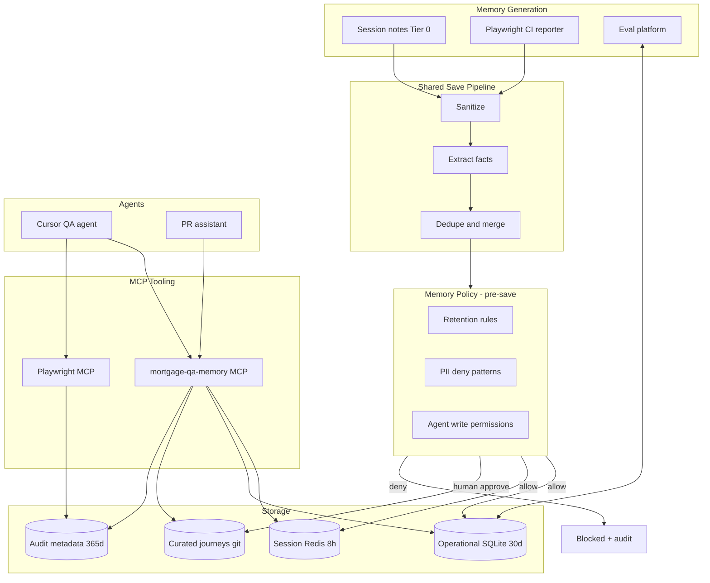

# Mortgage QA Memory MCP

**Repository:** `C:\Repo\mcp-memory`  
**Status:** Design & templates (implementation packages per [06-build-from-scratch.md](./06-build-from-scratch.md))

A from-scratch design for **Playwright QA automation** with a **custom Memory MCP**, **tiered retention**, and **mortgage compliance audit** — adapted from DoorDash's agentic memory architecture and Salesforce Agentic Memory patterns.

See [PROJECT-CONTEXT.md](./PROJECT-CONTEXT.md) for how this repo was assembled and [AGENTS.md](./AGENTS.md) for agent working rules.
---

## Who this is for

- Platform / QA engineers building internal AI tooling on **Cursor**, **Gemini gateway**, **KB MCP**, and **Azure MCP**
- Mortgage technology teams that need QA intelligence **without** creating a second store of loan data or NPI
- Teams evaluating **Playwright MCP** + a **QA memory expander** they control end-to-end

---

## Document index

| # | Document | Contents |
|---|----------|----------|
| 01 | [Architecture Overview](./01-architecture-overview.md) | System diagram, components, data flow, build order |
| 02 | [DoorDash Memory Pattern](./02-doordash-memory-pattern.md) | Review of DoorDash memory diagram; mapping to mortgage QA |
| 03 | [QA Automation & Playwright MCP](./03-qa-automation-playwright.md) | Browser automation, CI vs agentic modes, flakiness memory |
| 04 | [Mortgage Compliance & Audit](./04-mortgage-compliance-audit.md) | LL-2026-04, thin audit model, QC query surface |
| 05 | [Data Retention & Privacy](./05-data-retention-and-privacy.md) | Tiered memory, deny-by-default writes, what never to store |
| 06 | [Build From Scratch](./06-build-from-scratch.md) | Repo layout, phased implementation, code patterns |
| 07 | [MCP Tools Specification](./07-mcp-tools-specification.md) | Full tool catalog, inputs/outputs, policy gates |
| 08 | [Integration With Existing Stack](./08-integration-with-existing-stack.md) | Gateway, KB MCP, doc wizard, PR assistant, Azure, Cursor |
| 09 | [Multi-Domain Memory (Namespaces)](./09-multi-domain-memory.md) | Extending memory across QA, PR, ops, compliance, product |
| 10 | [DoorDash & Salesforce Deep Dive](./10-doordash-salesforce-memory-deep-dive.md) | **Primary reference to recreate memory architecture** |

### Reference artifacts

| Path | Purpose |
|------|---------|
| [policies/mqm-policy.yaml](./policies/mqm-policy.yaml) | Policy template: URLs, retention, deny patterns, write permissions |
| [examples/journeys/le_generation.yaml](./examples/journeys/le_generation.yaml) | Sample mortgage journey with TRID checkpoints |
| [examples/ai-inventory.yaml](./examples/ai-inventory.yaml) | LL-2026-04 AI tool inventory template |
| [examples/cursor/mcp.json](./examples/cursor/mcp.json) | Cursor MCP server configuration |
| [examples/cursor/skills/mortgage-qa-triage/SKILL.md](./examples/cursor/skills/mortgage-qa-triage/SKILL.md) | Cursor skill for CI triage workflow |

---

## Executive summary

### The problem

QA teams using AI agents (Cursor + Playwright MCP) face two opposing forces:

1. **Agents need memory** — flakiness history, journey maps, locators, environment quirks — or they rediscover the same failures every session.
2. **Mortgage teams must not hoard sensitive data** — NPI, raw snapshots, prompts with borrower fields, and unbounded long-term storage create compliance and security risk.

DoorDash's production memory architecture (see diagram in doc 02) solves a similar problem for consumer personalization by inserting **policy enforcement before save** and separating **generation → pipeline → storage → retrieval**.

This guide adapts that pattern for **internal mortgage QA automation**.

### The solution: Mortgage QA Memory (MQM)

| Layer | Our implementation |
|-------|-------------------|
| **Memory generation** | Playwright reporter + optional session notes from Cursor agents |
| **Shared save pipeline** | Sanitize → extract facts → dedupe → classify (no raw snapshots) |
| **Memory policy** | `mqm-policy.yaml` — retention, PII deny, URL allowlist, write tiers |
| **Storage** | Tier 0 session (ephemeral) / Tier 1 operational (SQLite, 30d) / Tier 2 curated (git YAML) |
| **Tooling** | Custom `mortgage-qa-memory` MCP server + official `@playwright/mcp` |
| **Audit** | Thin append-only log via Gemini gateway — metadata long, evidence short |
| **Eval** | Golden CI failure set; flake classification accuracy; checkpoint regression |

### What we explicitly do not build

- Full loan file intelligence (buy Ocrolus / vendor doc AI)
- Long-term storage of a11y snapshots, prompts, or network bodies
- Agent-driven Playwright in production CI (deterministic tests only in CI)
- Unapproved agent writes to curated journey/locator registries

### Recommended build sequence

```
Week 1: Policy + Playwright reporter + SQLite (read-only MCP)
Week 2: Journey YAML + compliance checkpoints + Cursor skill
Week 3: Playwright MCP local triage + audit client
Week 4: CI artifact + purge jobs + golden eval set
```

See [06-build-from-scratch.md](./06-build-from-scratch.md) for full detail.

---

## Architecture at a glance



---

## Key design decisions (locked)

| Decision | Choice | Rationale |
|----------|--------|-----------|
| Browser execution | Official `@playwright/mcp` for explore/repro only | Accessibility snapshots, cross-browser, tracing |
| CI execution | Deterministic `playwright test` + custom reporter | No agent token burn or NPI leak in CI |
| Long-term QA facts | Aggregates only (flake rate, signatures, pass/fail) | User concern: don't store data we don't want long-term |
| Curated definitions | Git-reviewed YAML (Tier 2) | Human approval = compliance control |
| Audit | Metadata 365d, evidence blobs 90d | LL-2026-04 traceability without PII archive |
| Flakiness OSS | Hybrid: borrow reporter pattern, own MCP + policy | Speed + mortgage-specific control |

---

## Related external references

- [DoorDash Ask DoorDash / InfoQ summary](https://www.infoq.com/news/2026/07/doordash-ai-ask-assistant/) — agentic memory + MCP + eval at scale
- [Playwright MCP docs](https://playwright.dev/docs/getting-started-mcp) — browser automation via MCP
- [flakiness-knowledge-graph-mcp](https://github.com/vola-trebla/flakiness-knowledge-graph-mcp) — reporter + SQLite + MCP pattern to fork
- [Fannie Mae LL-2026-04](https://singlefamily.fanniemae.com/news-events/lender-letter-ll-2026-04-governance-framework-use-artificial-intelligence-and-machine-learning) — AI governance for seller/servicers (effective Aug 6, 2026)
- [Blend Autopilot MCP](https://blend.com/company/newsroom/blend-launches-autopilot-mcp-server-opening-lending-platform-fi-built-ai-agents/) — lending MCP reference architecture

---

## Next steps

1. Review [05-data-retention-and-privacy.md](./05-data-retention-and-privacy.md) with security / compliance
2. Customize [policies/mqm-policy.yaml](./policies/mqm-policy.yaml) for your staging URLs and retention windows
3. Follow [06-build-from-scratch.md](./06-build-from-scratch.md) Week 1 checklist
4. Add three journey YAML files for your highest-traffic borrower flows
