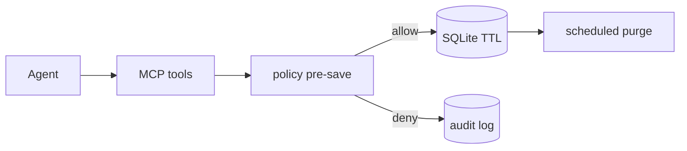

# 00 — Adoption Guide (for any AI agent or project)

**Read this first** if you are another AI, another repo, or a team deciding how to use, fork, or replace governed agent memory — especially around Anthropic's official MCP packages.

**This repo:** `naf-memory-vault` (Mortgage QA Memory / MQM) — a **reference implementation** of the mirror-and-govern pattern. Copy the **pattern**, not necessarily the mortgage domain logic.

**Last updated:** 2026-07-15

---

## 1. Decision in 60 seconds

| Question | Answer |
|----------|--------|
| Should we use `@modelcontextprotocol/server-memory` in production? | **No** — reference only; ungoverned JSONL persistence |
| Should we use `@modelcontextprotocol/sdk`? | **Yes** — protocol library; we pin **1.29.0** |
| Should we use this repo as-is? | **Yes for QA pilot** — governed POC/MVP in `packages/*` |
| Should we fork for another domain? | **Yes** — keep `core` engine; swap `qa` domain tools ([12-integration-mcp.md](./12-integration-mcp.md)) |

---

## 2. npm package assessment

### `@modelcontextprotocol/sdk` — **approved**

| | |
|---|---|
| **What it is** | Official MCP TypeScript library: `Server`, `Client`, stdio transport, JSON-RPC types |
| **What it is not** | Memory, policy, audit, or domain logic |
| **We use it in** | `packages/mcp-server` (server), `smoke.ts` (client) |
| **Security stance** | Low inherent risk; **you own what your server stores and who can call tools** |
| **Supply chain** | Pin version in lockfile; review upgrades |
| **Known gaps we accept** | No built-in auth; no resource subscriptions yet — see [archive/design-essays/16-playbook §5](./archive/design-essays/16-playbook-mirror-privatize.md) |

**Do not depend on** upstream `@modelcontextprotocol/server-memory`. We reimplemented its 9-tool surface in `packages/shared/src/kg.ts` with governance.

### `@modelcontextprotocol/server-memory` — **not approved for production**

| Risk | Severity | Our mitigation |
|------|----------|----------------|
| PII/secrets persisted verbatim | High | `deny_patterns` pre-save in [mqm-policy.yaml](../packages/policy/mqm-policy.yaml) |
| No TTL / retention | High | Per-namespace `retention_days` + purge job |
| No RBAC | High | Role + namespace RBAC |
| No audit | High | Hash-chained audit log |
| Memory poisoning | Medium | Policy gate; Tier 2 human PR for curated facts |
| Shared global graph | High | Namespace isolation |
| Flat JSONL fragility | Medium | SQLite + referential integrity |

Full leadership brief: [18-official-mcp-packages-risk-brief.md](./18-official-mcp-packages-risk-brief.md).

### Other npm deps (this repo)

| Package | Role | Security note |
|---------|------|---------------|
| `better-sqlite3` | Tier 1 + KG storage | Local file DB; protect path permissions |
| `tsx` | Dev runner | Dev-only |
| `@playwright/test` | E2E | CI only; staging allowlist in policy |

---

## 3. Security model (non-negotiables)

These apply to **every** namespace and **every** write path:



| Control | Status | Where |
|---------|--------|-------|
| Policy pre-save on every write | Done | `packages/shared/src/policy.ts` |
| PII / secret deny patterns | Done | `mqm-policy.yaml` — list in [14-operational-readiness §2](./14-operational-readiness.md) |
| Namespace RBAC (deny unknown) | Done | `isNamespaceWriteAllowed` / `isNamespaceReadAllowed` |
| Tier 2 human PR only | Done | `upsert_locator` → `require_approval` |
| Hash-chained audit | Done | `packages/audit-client` |
| Staging URL allowlist | Done | `urls.allowed_prefixes` in policy |
| Playwright MCP sandbox | Done | no `run_code_unsafe`; isolated headless |
| Verified caller identity (SSO) | **Gap** | `MQM_USER_ROLE` env — OK for POC; required for shared server |
| Encryption at rest | **Gap** | Local SQLite; use OS/disk encryption in prod |

**Auth is not optional forever:** POC can trust env vars; **shared team server requires gateway SSO** — [14-operational-readiness §3](./14-operational-readiness.md).

---

## 4. Feature map

### 4a. Core platform (generic — reusable in any project)

| Feature | Status | Evidence |
|---------|--------|----------|
| 9-tool KG parity with `server-memory` | Done | `kg.ts`, smoke test |
| `memory://knowledge-graph` resource (per namespace) | Done | `packages/mcp-server/src/index.ts` |
| Policy pre-save gate | Done | `evaluatePolicy` |
| Namespace isolation | Done | `qa`/`pr`/`ops`/`compliance`/`product` |
| TTL + hard-delete purge | Done | `purge.ts` |
| Audit trail + RBAC query | Done | `get_audit_trail` |
| Machine-readable manifest + CI drift | Done | `docs/tools.json` |
| MCP prompts (`triage_qa_failure`) | Done | `prompts.ts` |
| Resource live notifications | Gap | Poll `read_graph` |
| Semantic / vector search | Gap | Substring `search_nodes` only |
| Remote HTTP/SSE transport | Gap | stdio only |
| SSO-verified RBAC | Gap | NEEDS-ENV |

### 4b. QA domain (mortgage-specific — swap for your domain)

| Feature | Status | Evidence |
|---------|--------|----------|
| Flake ranking / skip-browser | Done | `get_flaky_tests`, `should_skip_browser` |
| Failure signatures (no raw errors) | Done | pipeline + redact |
| Tier 2 journeys (TRID/URLA/ECOA) | Done | `journeys/*.yaml` |
| Playwright reporter → SQLite | Done | `@mqm/reporter` |
| Memory console (read-only UI) | Done | `npm run console` |
| Real staging CI ingestion | Gap | NEEDS-ENV |
| 5 real failures triaged on staging | Gap | NEEDS-ENV |

### 4c. Namespace rollout

| Namespace | Phase | Writers | Owner needed? |
|-----------|-------|---------|---------------|
| `qa` | **Live** | qa_engineer, qa_lead | QA lead (implicit) |
| `pr` | Ready | engineer, qa_lead | Eng lead |
| `ops` | Locked | none | SRE lead — [14 §4](./14-operational-readiness.md) |
| `compliance` | Locked | none | Compliance/QC — [14 §4](./14-operational-readiness.md) |
| `product` | Defer | none | Product (later) |

Detail: [09-multi-domain-memory.md](./09-multi-domain-memory.md).

---

## 5. Paths forward (pick your stage)

### Path A — Evaluate locally (1 hour)

```bash
npm install && npm run seed:demo && npm run smoke   # expect SMOKE PASS
npm run console   # http://127.0.0.1:4173
```

Read: [11-implementation.md](./11-implementation.md), [18-official-mcp-packages-risk-brief.md](./18-official-mcp-packages-risk-brief.md).

### Path B — Stakeholder demo (half day)

Follow [15-poc-demo.md](./15-poc-demo.md). Prove PII deny, namespace deny, audit, flake triage without browser.

### Path C — Pilot on staging (needs environment)

1. Replace pilot URLs in `mqm-policy.yaml`
2. Wire Playwright reporter to staging CI
3. Triage 5 real failures — [14 §5](./14-operational-readiness.md)
4. Compliance review — [14 §6](./14-operational-readiness.md)

### Path D — Fork for another domain

1. Copy **core** pattern from [archive/design-essays/16-playbook-mirror-privatize.md](./archive/design-essays/16-playbook-mirror-privatize.md) §4 checklist
2. Keep `packages/shared/kg.ts`, `policy.ts`, `audit-client`
3. Replace `domain: "qa"` tools in `packages/mcp-server/src/tools.ts`
4. Add namespace + roles in policy YAML
5. Regenerate `docs/tools.json`; keep CI drift guard

Seams documented in [12-integration-mcp.md](./12-integration-mcp.md).

### Path E — Production hardening

| Step | Doc |
|------|-----|
| Compliance sign-off | [14 §6](./14-operational-readiness.md), [ai-inventory.yaml](../ai-inventory.yaml) |
| Namespace owners | [14 §4](./14-operational-readiness.md) |
| Gateway SSO | [12-integration-mcp.md §4](./12-integration-mcp.md), [08-integration-with-existing-stack.md](./08-integration-with-existing-stack.md) |
| Postgres / HA | [06-build-from-scratch.md](./06-build-from-scratch.md) post-MVP notes |
| Compare OSS peers | [archive/design-essays/17-governed-memory-landscape.md](./archive/design-essays/17-governed-memory-landscape.md) |

---

## 6. Acceptance gates

| Gate | Doc |
|------|-----|
| Engineering proof (tests, smoke, eval) | [13-definition-of-done.md](./13-definition-of-done.md) |
| Operational / compliance proof | [14-operational-readiness.md](./14-operational-readiness.md) |

---

## 7. Cleanup checklist (for adopters)

When copying this pattern into another repo:

- [ ] Remove `@modelcontextprotocol/server-memory` from MCP config if present
- [ ] Pin `@modelcontextprotocol/sdk`; do not float to latest without review
- [ ] Copy `mqm-policy.yaml` and customize deny patterns + URLs for your domain
- [ ] Set `MEMORY`/DB path outside `node_modules` and repo root
- [ ] Never commit `data/*.db` with real staging data
- [ ] Regenerate and CI-check `docs/tools.json`
- [ ] Delete mortgage-specific tools if pure generic memory — keep `domain: "core"` only
- [ ] Update `ai-inventory.yaml` (or equivalent) before production agents

---

## 8. Doc map (merged — no v1/v2 split)

| # | Document | Use when |
|---|----------|----------|
| **00** | [This guide](./00-adoption-guide.md) | Starting from zero; another AI/project |
| — | [rollout/README.md](./rollout/README.md) | QA phased rollout Q1–Q5 |
| — | [PROJECT-CONTEXT.md](./PROJECT-CONTEXT.md) | Why this repo exists |
| 01–04 | Architecture, DoorDash pattern, Playwright, compliance | Design rationale |
| 05 | [Data retention & privacy](./05-data-retention-and-privacy.md) | Tier philosophy |
| 06–07 | Build from scratch, tools spec | Implementation planning |
| 08 | [Enterprise stack integration](./08-integration-with-existing-stack.md) | Gateway, Azure, KB MCP |
| 09 | [Multi-domain memory](./09-multi-domain-memory.md) | Namespace phases |
| 10 | [DoorDash/Salesforce deep dive](./10-doordash-salesforce-memory-deep-dive.md) | Production reference |
| 11 | [Implementation](./11-implementation.md) | Quickstart, packages |
| 12 | [MCP integration](./12-integration-mcp.md) | Consume/extend MCP |
| 13 | [Definition of done](./13-definition-of-done.md) | Engineering gates |
| 14 | [Operational readiness](./14-operational-readiness.md) | Security/compliance gates |
| 15 | [POC demo](./15-poc-demo.md) | Stakeholder demo |
| 16 | [Playbook: mirror + privatize](./archive/design-essays/16-playbook-mirror-privatize.md) | Portable technical pattern |
| 17 | [Governed memory landscape](./archive/design-essays/17-governed-memory-landscape.md) | OSS/production survey |
| 18 | [Official MCP package risks](./18-official-mcp-packages-risk-brief.md) | Leadership decision |
| — | [tools.json](./tools.json) | Machine-readable contract |

---

## 9. Related code (quick lookup)

| Concern | File |
|---------|------|
| Tool surface | `packages/mcp-server/src/tools.ts` |
| KG engine | `packages/shared/src/kg.ts` |
| Policy gate | `packages/shared/src/policy.ts` |
| PII detection | `packages/shared/src/redact.ts` |
| Policy config | `packages/policy/mqm-policy.yaml` |
| Audit | `packages/audit-client/src/log.ts` |
| Manifest | `packages/mcp-server/src/manifest.ts` → `docs/tools.json` |
