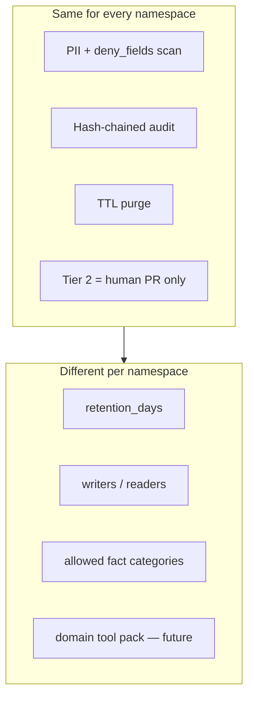

# 14 — Operational Readiness (POC → Production)

**Audience:** platform lead, QA lead, security/compliance, namespace owners.  
**Purpose:** Single place for gates, non-savable data, auth decisions, and namespace ownership — assembled for stakeholders.

**Companion docs:**

| Doc | Relationship |
|-----|--------------|
| [13-definition-of-done.md](./13-definition-of-done.md) | Engineering proof gates (DONE / NEEDS-ENV / NEEDS-HUMAN) |
| [18-official-mcp-packages-risk-brief.md](./18-official-mcp-packages-risk-brief.md) | Why not vanilla `server-memory` |
| [09-multi-domain-memory.md](./09-multi-domain-memory.md) | Namespace rollout phases and fact-key conventions |
| [05-data-retention-and-privacy.md](./05-data-retention-and-privacy.md) | Tier 0/1/2 philosophy |
| [packages/policy/mqm-policy.yaml](../../packages/policy/mqm-policy.yaml) | Enforced deny lists + namespace RBAC |
| [ai-inventory.yaml](../../ai-inventory.yaml) | LL-2026-04 inventory (pending sign-off) |

**Last updated:** 2026-07-15

---

## 1. Gate summary

| Gate | Status | Owner | What unblocks it |
|------|--------|-------|------------------|
| **POC engineering proof** | DONE | Engineering | `npm test`, `npm run smoke` → SMOKE PASS |
| **Interim non-savable list** | DONE (pending compliance review) | Engineering → Compliance | Use §2 below until compliance adds patterns |
| **Namespace structure (KG + RBAC)** | DONE | Engineering | `qa`/`pr`/`ops`/`compliance`/`product` in policy + smoke |
| **Namespace owners assigned** | NEEDS-HUMAN | Engineering manager | Fill §4 checklist; update `mqm-policy.yaml` writers |
| **Compliance sign-off** | NEEDS-HUMAN | Compliance / security | Approve [ai-inventory.yaml](../../ai-inventory.yaml) |
| **Real staging CI data** | NEEDS-ENV | QA + platform | Replace pilot URLs; wire Playwright reporter (§5) |
| **Verified caller identity (SSO)** | NEEDS-ENV | Platform | Required only for shared team server (§3) |

---

## 2. Interim non-savable data list

**Status:** enforced in code today via [mqm-policy.yaml](../../packages/policy/mqm-policy.yaml).  
Compliance should review, add mortgage-specific patterns (MERS MIN, account formats), and sign off before calling this **production-approved**.

### 2a. Never persist — whole field types (`deny_fields`)

| Don't save | Why | Save instead |
|------------|-----|--------------|
| Raw browser / a11y snapshots | Form field values leak | Pass/fail + `snapshot_hash` |
| Full prompts | Sensitive context copy | `prompt_template_id` |
| Full LLM responses | Same | One-line `outcome.summary` |
| Network response bodies | Loan payloads in JSON | HTTP status + route pattern |
| Screenshot / image bytes | Visual PII | Omit or blurred short-TTL blob |
| Full stack traces | Often embed names, IDs, SSN | `error_class` + normalized signature |
| Full error messages | Same risk | Truncated `error_hint` (redacted) |

### 2b. Never persist — pattern scan (`deny_patterns`)

| Pattern | Example |
|---------|---------|
| SSN with dashes | `123-45-6789` |
| Bare 9-digit SSN | `123456789` |
| 16-digit card-like number | `4111111111111111` |
| Secrets in key:value form | `password:`, `api_key=`, `token:` |
| SSN-related words | `ssn`, `social security`, `taxpayer id` |

### 2c. Never persist — business rules

| Don't save | Why | Save instead |
|------------|-----|--------------|
| Real borrower names | PII | Synthetic `loan_scenario_id` only |
| Real loan / account numbers | NPI | Allowed synthetic IDs only (`synthetic-retail-01`, etc.) |
| Credit score, income, DTI | Regulated | Boolean checkpoint pass/fail |
| Production URLs / cookies | Security | Staging/UAT allowlist only |
| Real DOB | PII | Don't store; audit metadata flag only if needed |

### 2d. Shared vs per-namespace

| Rule | Scope |
|------|-------|
| `deny_fields`, `deny_patterns`, loan scenario allowlist | **All namespaces** — same gate everywhere |
| Retention TTL, writers, readers | **Per namespace** — see §4 |
| Tier 2 human PR for curated facts | **All namespaces** |

---

## 3. Auth: when do you need per-user identity?

Auth controls **who can read/write which namespace**. It does **not** replace PII deny — policy blocks SSN for everyone.

| Deployment stage | Per-user auth required? | What we use today |
|------------------|-------------------------|-------------------|
| **POC** — one dev, MCP on their laptop | No | `MQM_USER_ROLE` env var (honor system) |
| **Pilot** — small team, each on own laptop + own SQLite | Low urgency | Same; isolated DB per machine |
| **Shared service** — one memory DB, many users/agents | **Yes, required** | Gateway SSO must assert role before MCP sees the call |

**NEEDS-ENV item:** replace trust-on-honor `MQM_USER_ROLE` with cryptographically verified identity at the gateway. See [12-integration-mcp.md](./12-integration-mcp.md) and [archive/design-essays/16-playbook-mirror-privatize.md §6](./archive/design-essays/16-playbook-mirror-privatize.md).

---

## 4. Namespace owners checklist

Each namespace is a **separate bucket** on one MCP server. Same policy pipeline and audit; different purpose, retention, and access.

### 4a. Current policy (source of truth)

From [mqm-policy.yaml](../../packages/policy/mqm-policy.yaml):

| Namespace | Purpose | Retention | Writers today | Readers today | Phase |
|-----------|---------|-----------|---------------|---------------|-------|
| `qa` | Playwright flakes, test triage, KG | 30d | qa_engineer, qa_lead | qa_engineer, qa_lead, qc_analyst, engineer | **Live** |
| `pr` | PR assistant, repo patterns | 30d | engineer, qa_lead | engineer, qa_lead | Ready (domain tools TBD) |
| `ops` | Incident signatures, deploy correlation | 30d | **none** (locked) | engineer | Locked — needs owner |
| `compliance` | Audit refs, RFP answer pointers | 365d | **none** (locked) | qc_analyst | Locked — needs owner |
| `product` | Short-lived session prefs | 7d | **none** (locked) | **none** | Locked — defer |

Only the `platform` role can write to locked namespaces today (break-glass).

### 4b. What each owner decides

| Decision | `ops` owner (e.g. SRE lead) | `compliance` owner (e.g. QC / compliance) |
|----------|----------------------------|-------------------------------------------|
| Allowed fact types | incident signature, runbook ref, deploy correlation — **not** raw logs | `rfp_answer_ref`, policy version refs — **not** full RFP text |
| Writers | sre role? automated reporter? **not** all engineers | **Human only** recommended — no agent auto-write |
| Readers | SRE + on-call engineers | qc_analyst + compliance team |
| Retention | Confirm 30d or request longer | Confirm 365d with legal |
| Tier 2 | Curated runbooks via Git PR | Curated policy refs via Git PR |

### 4c. Sign-off worksheet (fill in names)

| Namespace | Owner name / team | Owner email | Writers approved | Target go-live | Signed |
|-----------|-------------------|-------------|------------------|----------------|--------|
| `qa` | _________________ | _________________ | qa_engineer, qa_lead | **Live** | ☐ |
| `pr` | _________________ | _________________ | engineer, qa_lead | _________________ | ☐ |
| `ops` | _________________ | _________________ | _________________ | _________________ | ☐ |
| `compliance` | _________________ | _________________ | _________________ | _________________ | ☐ |
| `product` | _________________ | _________________ | _________________ | Defer | ☐ |

After sign-off: update `namespaces:` in [mqm-policy.yaml](../../packages/policy/mqm-policy.yaml) and re-run `npm run smoke`.

---

## 5. Real staging CI data (NEEDS-ENV)

**Today:** proof uses synthetic demo data (`npm run seed:demo`, golden eval set).  
**Goal:** Playwright reporter writes **real** staging run summaries; agents triage **real** failures from memory.

### Checklist

- [ ] Replace `*.pilot-mortgage.example` in [mqm-policy.yaml](../../packages/policy/mqm-policy.yaml) with real staging/UAT hostnames
- [ ] Wire `@mqm/reporter` into staging Playwright CI job
- [ ] Confirm `drop_run_on_pii_detected: true` drops bad rows (don't redact-in-place for CI errors)
- [ ] Triage ≥5 real staging failures via MCP; confirm flake ranking helps
- [ ] Re-run eval with `MQM_RUN_E2E=1` when real failure corpus exists

---

## 6. Compliance sign-off (NEEDS-HUMAN)

**Artifact:** [ai-inventory.yaml](../../ai-inventory.yaml) — currently `review_status: draft_pending_signoff`.

### 30-minute review agenda

1. Walk [18-official-mcp-packages-risk-brief.md](./18-official-mcp-packages-risk-brief.md) — why not vanilla `server-memory`
2. Review §2 non-savable list above — add mortgage-specific deny patterns if needed
3. Confirm retention (30d operational, 365d audit metadata, Tier 2 until superseded)
4. Confirm RBAC: who gets `get_audit_trail`
5. Live demo: `npm run smoke` → SMOKE PASS; show PII deny + namespace deny
6. Update `review_status` → `approved` (or list conditions)

---

## 7. What's shared vs what's different (quick reference)

---

## 8. Pre-production checklist (printable)

- [ ] §2 non-savable list reviewed by compliance
- [ ] §4 namespace owners named; locked namespaces updated in policy
- [ ] [ai-inventory.yaml](../../ai-inventory.yaml) signed off
- [ ] Real staging URLs in policy; reporter wired (§5)
- [ ] SSO / verified identity plan if moving to shared server (§3)
- [ ] `npm run smoke` → SMOKE PASS on staging-connected config
- [ ] Purge job scheduled (`retention.auto_purge` in policy)

---

## Related docs

- [15-poc-demo.md](./15-poc-demo.md) — live stakeholder demo script
- [archive/design-essays/16-playbook-mirror-privatize.md](./archive/design-essays/16-playbook-mirror-privatize.md) — technical mirror + govern playbook
- [11-implementation.md](./11-implementation.md) — package map + quickstart
