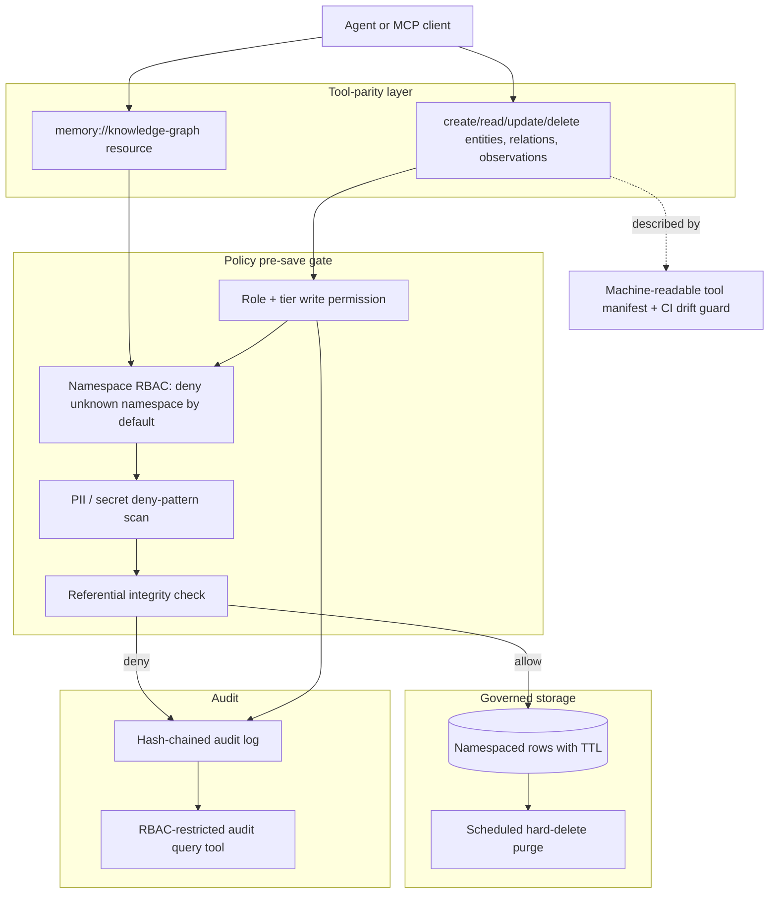

# 16 — Playbook: Mirror and Privatize `@modelcontextprotocol/server-memory`

**Status:** portable playbook. Drop this file into any project that wants to give agents
persistent entity/relation memory without depending on Anthropic's unmanaged reference
server. This repo (`mcp-memory` / Mortgage QA Memory) is cited throughout as the worked,
tested reference implementation — but nothing here is mortgage-specific. If you're
building this pattern in a different codebase, copy the pattern, not the mortgage
domain logic.

Companion reading in this repo: [10-doordash-salesforce-memory-deep-dive.md](./10-doordash-salesforce-memory-deep-dive.md)
(source architecture patterns), [05-data-retention-and-privacy.md](./05-data-retention-and-privacy.md)
(the retention/PII philosophy this playbook operationalizes for generic KG memory),
[17-governed-memory-landscape.md](./17-governed-memory-landscape.md) (OSS peers and production teams survey),
[18-official-mcp-packages-risk-brief.md](./18-official-mcp-packages-risk-brief.md) (leadership decision brief on official packages),
[14-operational-readiness.md](./14-operational-readiness.md) (non-savable list, auth, namespace owners, compliance gates).

---

## 1. Why not depend on the package directly

[`@modelcontextprotocol/server-memory`](https://www.npmjs.com/package/@modelcontextprotocol/server-memory)
is Anthropic's official reference server for persistent agent memory: a small
`KnowledgeGraphManager` over a single JSONL file, exposing entity/relation/observation
tools. It is intentionally minimal — a teaching reference, not a production system.

For a company with any regulated, confidential, or otherwise sensitive data flowing
through agent sessions, using it as-is means:

| Gap | Concrete risk |
|---|---|
| No PII/secret scanning on writes | An agent can paste an SSN, API key, or customer record into an `observation` string and it's persisted verbatim |
| No retention / TTL | Data lives in the JSONL file forever until a human manually edits it |
| No RBAC | Any caller with tool access can read or write anything in the graph |
| No audit trail | No record of who wrote/read/deleted what, or when |
| No namespace isolation | One global graph — a "QA" agent and a "compliance" agent share the same space by default |
| No referential integrity | Relations can point at entities that don't exist |
| Flat-file storage | No transactional guarantees, no indexing, no concurrent-writer safety beyond the process itself |

None of this makes the package bad — it does exactly what a reference implementation
should do. It just means **do not point it at your production agents if your company
has any data you'd be uncomfortable finding in an unencrypted, ungoverned text file.**

The fix is not to avoid entity/relation memory — it's to keep the same useful
abstraction and put governance in front of it, matching the "Memory Policy enforced
pre-save" pattern from DoorDash/Salesforce's production memory systems (doc 10).

---

## 2. The pattern: "Mirror the tool surface, own the governance"

Keep the tool names, argument shapes, and semantics identical to the upstream
package — anyone (human or agent) who already knows the vanilla tools can use your
privatized version with zero relearning. Then insert a governance spine underneath
that upstream has none of.

Six layers, each independently testable:

1. **Tool-parity layer** — identical schemas so the API is a drop-in replacement
2. **Policy pre-save gate** — nothing reaches storage without passing role/tier, namespace, and PII checks
3. **Namespace isolation** — deny-by-default for any namespace the caller's role hasn't been explicitly granted
4. **Governed storage** — a real database with per-row expiry, not a flat file with no lifecycle
5. **Audit** — tamper-evident (hash-chained) log of every read/write/deny, queryable by authorized roles only
6. **Manifest + CI drift guard** — the tool contract is machine-readable and checked in CI so it can't silently drift from the code

---

## 3. Feature-by-feature comparison

| Dimension | `@modelcontextprotocol/server-memory` | Privatized pattern | This repo's implementation |
|---|---|---|---|
| Storage backend | Single flat JSONL file | Namespaced, indexed, TTL'd rows in a real database | SQLite tables `kg_entities` / `kg_observations` / `kg_relations` — [packages/shared/src/db.ts](../../packages/shared/src/db.ts) |
| PII / secret handling | None | Every string field scanned against deny-patterns pre-save; a hit denies that item only, not the whole batch | `evaluatePolicy` in [packages/shared/src/policy.ts](../../packages/shared/src/policy.ts), called per-item from [packages/shared/src/kg.ts](../../packages/shared/src/kg.ts) |
| Retention | None (manual file edits only) | Per-namespace TTL, enforced by a scheduled hard-delete purge | `namespaceRetentionDays` + `purgeExpiredKg`, wired into [packages/shared/src/purge.ts](../../packages/shared/src/purge.ts) |
| RBAC | None | Role-based tool permission + a second, namespace-scoped writer/reader list; unknown namespace = deny | `isNamespaceWriteAllowed` / `isNamespaceReadAllowed` in policy.ts; config in [packages/policy/mqm-policy.yaml](../../packages/policy/mqm-policy.yaml) `namespaces:` block |
| Namespace isolation | None (one global graph) | Every row tagged with a namespace; queries always scoped; cross-namespace reads/writes require explicit RBAC | Same as above; enforced in every `kg.ts` function via `ctx.namespace` |
| Audit | None | Hash-chained append-only log of every tool call (success/blocked/failure) | [packages/audit-client/src/log.ts](../../packages/audit-client/src/log.ts) `logAudit` |
| Referential integrity | Relations can reference nonexistent entities | Relation creation checks both endpoints exist in-namespace first | `createRelations` in kg.ts (a real bug caught during this project's own smoke test — see §6) |
| Resource exposure | Static `memory://knowledge-graph`, no auth | Same resource shape, but namespace-scoped and RBAC-filtered in `resources/list` | [packages/mcp-server/src/index.ts](../../packages/mcp-server/src/index.ts) `ListResourcesRequestSchema`/`ReadResourceRequestSchema` handlers |
| Transport | stdio only | stdio for local/IDE use; same code is transport-agnostic for a future remote deployment | Currently stdio only — see gap list in §5 |
| Contract stability | None — must read source to know the tool surface | Machine-readable manifest, regenerated and diff-checked in CI | [packages/mcp-server/src/manifest.ts](../../packages/mcp-server/src/manifest.ts) → `docs/tools.json`, checked in `.github/workflows/qa-memory.yml` |

---

## 4. Adoption checklist (portable — follow in any project)

1. **Reimplement the 9 tools + resource with byte-identical schemas.** Don't invent new
   argument names — copy `create_entities(entities[])`, `create_relations(relations[])`,
   `add_observations(observations[])`, `delete_entities(entityNames[])`,
   `delete_observations(deletions[])`, `delete_relations(relations[])`, `read_graph()`,
   `search_nodes(query)`, `open_nodes(names[])` verbatim, plus the
   `memory://knowledge-graph` resource shape. Reference:
   [packages/mcp-server/src/tools.ts](../../packages/mcp-server/src/tools.ts),
   [packages/shared/src/kg.ts](../../packages/shared/src/kg.ts).
2. **Add a policy pre-save gate.** One function every write path must call before
   touching storage — role/tier permission, then PII/secret pattern scan, then any
   domain-specific allowlist. Reference: `evaluatePolicy` in
   [packages/shared/src/policy.ts](../../packages/shared/src/policy.ts).
3. **Add namespace isolation, deny-by-default.** An undeclared namespace has no
   writers/readers — don't default to "allow" for the unknown case. Reference:
   `isNamespaceWriteAllowed`/`isNamespaceReadAllowed`, and the `namespaces:` block in
   [packages/policy/mqm-policy.yaml](../../packages/policy/mqm-policy.yaml).
4. **Add tiered retention + a purge job.** Every row gets an `expires_at`; a scheduled
   job hard-deletes past-expiry rows. Don't soft-delete — reduces forensic recovery
   risk. Reference: [packages/shared/src/purge.ts](../../packages/shared/src/purge.ts).
5. **Add a hash-chained audit log.** Every tool call — success, denial, or error —
   appends a row referencing the previous row's hash, so tampering is detectable.
   Reference: [packages/audit-client/src/log.ts](../../packages/audit-client/src/log.ts).
6. **Add referential-integrity checks upstream skips.** At minimum, reject relations
   whose endpoints don't exist in the namespace — otherwise denied/deleted entities
   leave dangling edges in the graph.
7. **Add tests that assert the governance, not just the CRUD.** "PII in an observation
   denies that entity but not the batch," "unknown namespace is denied," "namespace
   isolation holds across reads" — these are the tests that matter, more than
   round-trip create/read tests. Reference:
   [packages/shared/test/kg.test.ts](../../packages/shared/test/kg.test.ts).
8. **Wire a machine-readable manifest + CI drift guard.** Generate a JSON contract
   from your tool definitions and fail CI if it's stale — this is what lets other
   tools/teams discover your surface without parsing your source. Reference:
   [packages/mcp-server/src/manifest.ts](../../packages/mcp-server/src/manifest.ts) and
   the manifest-diff step in `.github/workflows/qa-memory.yml`.

---

## 5. Best-practices audit A — MCP protocol / SDK

Grounded in the capabilities actually present in the installed
`@modelcontextprotocol/sdk` (resolved version **1.29.0** in this repo's
[package-lock.json](../../package-lock.json) — verified by grepping the SDK's
`types.js` for exported request schemas, not assumed from memory). Status legend:
**Done** (implemented + tested here), **Partial**, **Gap** (not implemented; noted
honestly rather than left ambiguous).

| Capability | What it's for | Status here | Notes |
|---|---|---|---|
| `tools/list`, `tools/call` | Core tool surface | Done | 22 tools across QA + core domains — [packages/mcp-server/src/tools.ts](../../packages/mcp-server/src/tools.ts) |
| `resources/list`, `resources/read` | Expose readable state | Done | Namespace-scoped `memory://knowledge-graph[/ns]` |
| `resources/subscribe`, `resources/unsubscribe` + update notifications | Push live updates instead of polling | **Gap** | Explicitly deferred; callers must poll `read_graph` |
| `prompts/list`, `prompts/get` | Server-authored, portable workflow templates | Done | `triage_qa_failure` — [packages/mcp-server/src/prompts.ts](../../packages/mcp-server/src/prompts.ts); makes the triage workflow usable by any MCP host, not just Cursor's skill file |
| `completion/complete` | Argument autocomplete (e.g. valid `namespace`/`journey_id` values) | **Gap** | Would improve UX for `namespace`, `journey_id`, `checkpoint_id` args |
| `sampling/createMessage` | Server asks the *client's* LLM to generate something, without the server holding a model key | **Gap** | Relevant for flake classification without baking an LLM key into the server |
| `elicitation/create` | Server pauses mid-call to ask the human for structured input | **Gap** | Natural fit for the Tier 2 `upsert_locator` approval flow, which today just returns a text `require_approval` |
| `logging/setLevel` + log notifications | Structured, filterable log stream to the client | **Gap** | Currently one `console.error` line at server boot only |
| Tasks (`tasks/get`, `tasks/list`, `tasks/cancel`) | Pollable status for long-running operations | **Gap** | Relevant for the eval run or purge job if triggered from an agent rather than CI |
| Transport | stdio vs. remote (Streamable HTTP/SSE) | Partial | stdio only today — fine for one-process-per-IDE, not for a shared team service (see doc 08's deployment topology) |

The takeaway: **tools and resources are the minimum bar, and this repo clears it.**
Prompts (added this session) start using the protocol beyond the bare minimum.
Elicitation, sampling, subscriptions, and completion are all real, available levers
in the SDK that remain unused — worth prioritizing in the order: elicitation (Tier 2
approval UX) → subscriptions (reduce polling) → completion (UX polish) → sampling/tasks
(only needed if a server-side LLM or long-running job gets added).

---

## 6. Best-practices audit B — data governance / security

| Practice | Status here | Evidence | Notes |
|---|---|---|---|
| PII/secret scan on every write, pre-save | Done | `evaluatePolicy` deny-pattern scan, [packages/shared/test/kg.test.ts](../../packages/shared/test/kg.test.ts) "PII in an observation denies that entity only" | Per-item denial, not whole-batch failure |
| Deny-by-default RBAC | Done | Unknown namespace → deny; `qc_analyst` role can write nothing | `isNamespaceWriteAllowed` returns `false` when the namespace isn't declared |
| Per-namespace retention + hard delete | Done | `namespaceRetentionDays`, `purgeExpiredKg`, nightly cron in policy `auto_purge` block | Hard delete, not soft delete, per [05-data-retention-and-privacy.md](./05-data-retention-and-privacy.md) |
| Tamper-evident audit | Done | Hash-chained `audit_events` table, `get_audit_trail` RBAC-restricted to `qa_lead`/`qc_analyst`/`platform` | |
| Least-privilege roles | Done | 5 distinct roles with different read/write/tier scopes | [packages/policy/mqm-policy.yaml](../../packages/policy/mqm-policy.yaml) `roles:` block |
| Referential integrity on writes | Done | `createRelations` rejects edges to nonexistent entities | Caught as a real bug during this project's own smoke test (see below) |
| Human-in-the-loop for curated/high-trust data | Done | Tier 2 (`upsert_locator`, journeys) is never a direct agent write — always `require_approval`, human opens a PR | |
| Secrets never logged, even in audit | Done | Audit rows store `args_summary` (a short derived string), never raw args | [packages/audit-client/src/log.ts](../../packages/audit-client/src/log.ts) |
| CI drift guard on the tool contract | Done | `git diff --exit-code -- docs/tools.json` after manifest regeneration | `.github/workflows/qa-memory.yml` |
| Verified caller identity for RBAC | **Gap (NEEDS-ENV)** | RBAC trusts the `MQM_USER_ROLE` env var as-is | Fine for a single-IDE pilot; needs a gateway/SSO to cryptographically assert the role claim before this is safe for a shared/remote deployment |
| All declared namespaces actually usable | **Partial (policy decision, not a code gap)** | `ops`/`compliance`/`product` namespaces exist structurally but have empty `writers` lists — only the `platform` break-glass role can write there today | Intentionally conservative default; owner worksheet in [14-operational-readiness.md §4](./14-operational-readiness.md#4-namespace-owners-checklist) |
| Semantic (not just substring) search | **Gap** | `search_nodes` is case-insensitive substring match only | Acceptable for v1 volume; revisit if namespaces grow large enough that substring recall becomes a problem |
| Annual policy/compliance review cadence | Partial | [packages/policy/mqm-policy.yaml](../../packages/policy/mqm-policy.yaml) declares an annual review cadence and named approvers | Process commitment, not something code can enforce — needs a human owner and calendar reminder |

**A worked example of why the referential-integrity check matters:** during this
project's own end-to-end smoke test, `create_entities` correctly denied an entity
containing a fake SSN in one of its observations — but a *separate* `create_relations`
call still succeeded in creating an edge pointing at that never-created entity, because
upstream's reference implementation doesn't validate that relation endpoints exist.
That's a real, observed governance gap the "just mirror the tool surface" approach
would have silently inherited. The fix — reject relations whose endpoints don't
exist in the namespace — is the single clearest illustration of why "mirror + govern"
beats "mirror alone."

---

## 7. Reference implementation appendix

Quick lookup table for copy-paste reuse in a different project. Each row is one piece
of the pattern from §2, mapped to its exact location in this repo.

| Pattern piece | File | Key export(s) |
|---|---|---|
| Tool schemas (parity layer) | [packages/mcp-server/src/tools.ts](../../packages/mcp-server/src/tools.ts) | `tools`, `TOOL_META` |
| Knowledge-graph engine (CRUD + search) | [packages/shared/src/kg.ts](../../packages/shared/src/kg.ts) | `createEntities`, `createRelations`, `addObservations`, `deleteEntities`, `deleteObservations`, `deleteRelations`, `readGraph`, `searchNodes`, `openNodes`, `purgeExpiredKg` |
| Policy pre-save gate + namespace RBAC | [packages/shared/src/policy.ts](../../packages/shared/src/policy.ts) | `evaluatePolicy`, `isNamespaceWriteAllowed`, `isNamespaceReadAllowed`, `namespaceRetentionDays` |
| PII/secret detection | [packages/shared/src/redact.ts](../../packages/shared/src/redact.ts) | `containsPii`, `classifyAndRedact` |
| Storage schema (namespaced, TTL'd) | [packages/shared/src/db.ts](../../packages/shared/src/db.ts) | `openDb` (see `kg_entities`/`kg_observations`/`kg_relations` tables) |
| Retention purge job | [packages/shared/src/purge.ts](../../packages/shared/src/purge.ts) | `purgeExpired` |
| Hash-chained audit | [packages/audit-client/src/log.ts](../../packages/audit-client/src/log.ts) | `logAudit`, `getAuditTrail` |
| MCP server wiring (tools + resources + prompts) | [packages/mcp-server/src/index.ts](../../packages/mcp-server/src/index.ts) | request handlers for `CallToolRequestSchema`, `ListResourcesRequestSchema`, `ReadResourceRequestSchema`, `ListPromptsRequestSchema`, `GetPromptRequestSchema` |
| Portable MCP-native prompt (workflow, not just a skill file) | [packages/mcp-server/src/prompts.ts](../../packages/mcp-server/src/prompts.ts) | `prompts`, `renderPrompt` |
| Machine-readable contract + CI drift guard | [packages/mcp-server/src/manifest.ts](../../packages/mcp-server/src/manifest.ts), `.github/workflows/qa-memory.yml` | `buildManifest` |
| Governance-focused test suite | [packages/shared/test/kg.test.ts](../../packages/shared/test/kg.test.ts), [policy.test.ts](../../packages/shared/test/policy.test.ts) | — |
| Namespace + retention configuration | [packages/policy/mqm-policy.yaml](../../packages/policy/mqm-policy.yaml) | `namespaces:`, `write_permissions:`, `roles:` |

---

## How to use this playbook on a different project

1. Read §1–2 to align on the problem and the six-layer pattern.
2. Work through §4's adoption checklist in order — each step is independently
   testable before moving to the next.
3. Use §5 and §6 as a self-audit once your implementation exists: for each row, mark
   Done/Partial/Gap the same way this doc does, and decide which gaps are acceptable
   for your v1 versus which block shipping.
4. Use §7 as a lookup table when you want to see exactly how one piece was implemented
   here, without re-deriving it from scratch.

This doc should be updated whenever the reference implementation in this repo changes
in a way that affects the pattern (not for mortgage-QA-specific changes that don't
touch the generic core).
