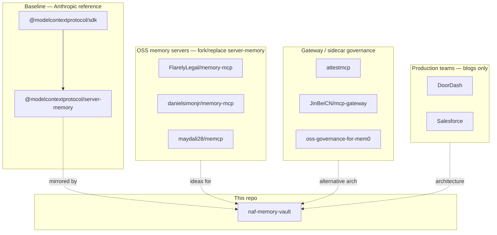

# 17 — Governed Memory MCP Landscape

**Status:** reference survey for team review.  
**Purpose:** Catalog open-source projects, gateway patterns, and production write-ups that mirror what this repo (`naf-memory-vault` / Mortgage QA Memory) is building — so we can compare approaches, borrow ideas, and avoid reinventing wheels.

**Companion docs in this repo:**

| Doc | Relationship |
|-----|--------------|
| [16-playbook-mirror-privatize.md](./16-playbook-mirror-privatize.md) | Our portable playbook: mirror `server-memory` tool surface + own governance |
| [10-doordash-salesforce-memory-deep-dive.md](./10-doordash-salesforce-memory-deep-dive.md) | Production team patterns (DoorDash, Salesforce) — deepest blog analysis |
| [05-data-retention-and-privacy.md](./05-data-retention-and-privacy.md) | Our retention / PII philosophy |
| [18-official-mcp-packages-risk-brief.md](./18-official-mcp-packages-risk-brief.md) | Leadership risk brief: official SDK vs server-memory |
| [14-operational-readiness.md](./14-operational-readiness.md) | Production gates: non-savable list, auth, namespace owners |
| [packages/policy/mqm-policy.yaml](../../../packages/policy/mqm-policy.yaml) | Our policy config |
| [packages/mcp-server/src/tools.ts](../../../packages/mcp-server/src/tools.ts) | Our tool surface |
| [packages/shared/src/kg.ts](../../../packages/shared/src/kg.ts) | Our governed KG engine |

**Last reviewed:** 2026-07-15 (manual survey; star counts and activity change — re-check URLs before betting on a dependency).

---

## 1. How to read this doc

Projects fall into **five buckets**:



| Bucket | Question it answers |
|--------|---------------------|
| **Baseline** | What does Anthropic ship, and what is it *not* for? |
| **OSS memory servers** | Who else forked/replaced `server-memory` with SQLite, RBAC, retention? |
| **Gateway / sidecar** | Who puts policy *outside* the memory server? |
| **Mem0 ecosystem** | Who uses vector/embedding memory instead of entity/relation graphs? |
| **Production teams** | Who runs this at scale without open-sourcing the server? |
| **Enterprise MCP governance** | Who secures MCP generally (not memory-specific)? |

---

## 2. Baseline — Anthropic / MCP official

These are the starting point our repo mirrors and extends.

### `@modelcontextprotocol/sdk`

| Field | Detail |
|-------|--------|
| **URL** | [npm](https://www.npmjs.com/package/@modelcontextprotocol/sdk) · [TypeScript SDK repo](https://github.com/modelcontextprotocol/typescript-sdk) |
| **What it is** | Official MCP protocol library: `Server` / `Client`, stdio + HTTP transports, JSON-RPC types |
| **What it is not** | Memory, policy, audit, or domain logic |
| **Anthropic scenario** | Build any MCP server or client; wire tools/resources/prompts to hosts (Claude Desktop, Cursor, VS Code) |
| **We use it in** | `packages/mcp-server` (`Server`, `StdioServerTransport`, request schemas); `smoke.ts` (`Client`) |
| **v2 note** | SDK is splitting into `@modelcontextprotocol/server` + `@modelcontextprotocol/client` (beta). We pin v1 (`1.29.0`). |

### `@modelcontextprotocol/server-memory`

| Field | Detail |
|-------|--------|
| **URL** | [npm](https://www.npmjs.com/package/@modelcontextprotocol/server-memory) · [source](https://github.com/modelcontextprotocol/servers/tree/main/src/memory) |
| **What it is** | Reference MCP server: entity/relation/observation knowledge graph in a local JSONL file |
| **Tools** | `create_entities`, `create_relations`, `add_observations`, `delete_*`, `read_graph`, `search_nodes`, `open_nodes` |
| **Resource** | `memory://knowledge-graph` (with live update notifications on mutations) |
| **Anthropic scenario** | Cross-session **chat personalization** on a single machine — remember user identity, prefs, goals, relationships |
| **Explicit gaps** | No PII scan, RBAC, TTL, audit, namespaces, referential integrity |
| **We mirror it in** | `packages/shared/src/kg.ts` + core tools in `packages/mcp-server/src/tools.ts` |

**Anthropic's example personalization prompt** (from upstream README): retrieve graph at session start; watch for identity/behavior/preference/goal/relationship facts; update via entities + relations + observations. Intended for Claude.ai Project custom instructions.

---

## 3. OSS memory servers — closest GitHub peers

These extend or replace `server-memory`. **Highest relevance for our review.**

### FlarelyLegal/memory-mcp

| Field | Detail |
|-------|--------|
| **URL** | [github.com/FlarelyLegal/memory-mcp](https://github.com/FlarelyLegal/memory-mcp) |
| **Maturity** | Small (few stars); ambitious scope |
| **What it does** | Remote MCP memory on Cloudflare Workers: knowledge graph, semantic search (Vectorize), team-shared namespaces |
| **Governance** | Namespace RBAC (owner / editor / viewer), group sharing, per-write audit → D1 + R2 NDJSON archive |
| **Retention** | Temporally-decayed recall |
| **Storage** | D1 (SQLite), Vectorize, R2, KV, Durable Objects |
| **Extra** | REST API + OpenAPI admin surface alongside MCP tools |
| **Learn from** | Team RBAC on namespaces, audit archive for SIEM, hosted multi-tenant memory |
| **vs MQM** | Closest OSS peer to our `namespaces:` + audit model; no mortgage QA domain, no Tier 2 PR gate, no PII deny patterns documented |

### danielsimonjr/memory-mcp

| Field | Detail |
|-------|--------|
| **URL** | [github.com/danielsimonjr/memory-mcp](https://github.com/danielsimonjr/memory-mcp) |
| **Maturity** | Active fork; very large tool surface (~200+ tools via `memoryjs`) |
| **What it does** | Enhanced `server-memory` fork: JSONL or SQLite (FTS5), semantic/fuzzy/boolean search, RDF export, bitemporal/causal graph features |
| **Governance** | RBAC tools (reader/writer/admin/owner) — Phase 15 / memoryjs η.6.1 |
| **Storage** | JSONL default; SQLite with WAL + FTS5 for scale |
| **Learn from** | Storage factory pattern, FTS5 search upgrade path, how far the KG model can stretch |
| **vs MQM** | Richer search/graph features; tool bloat risk; less focused compliance story than our policy pre-save gate |

### maydali28/memcp

| Field | Detail |
|-------|--------|
| **URL** | [github.com/maydali28/memcp](https://github.com/maydali28/memcp) |
| **Maturity** | Niche; Claude Code / session-focused |
| **What it does** | MAGMA 4-graph (semantic, temporal, causal, entity edges); auto-save hooks before `/compact`; tiered search |
| **Governance** | Project isolation from git root; session tracking |
| **Retention** | **3-zone lifecycle:** Active → Archive (compressed) → Purge (logged deletion) |
| **Storage** | SQLite `graph.db` + filesystem under `~/.memcp/` |
| **Learn from** | Retention preview/dry-run tools, archive restore, anti-context-loss hooks |
| **vs MQM** | Similar retention philosophy to [packages/shared/src/purge.ts](../../packages/shared/src/purge.ts); no RBAC/audit/PII layer |

### j0hanz/memory-mcp

| Field | Detail |
|-------|--------|
| **URL** | [github.com/j0hanz/memory-mcp](https://github.com/j0hanz/memory-mcp) |
| **Maturity** | Focused, clean implementation |
| **What it does** | SQLite + FTS5 + directed relationship graph; BFS recall; token-budget `retrieve_context` |
| **Governance** | None (local single-user) |
| **Tools** | 13 tools: CRUD, batch, search, recall, relationships, stats |
| **Learn from** | Graph traversal, token-budget retrieval for LLM context packing |
| **vs MQM** | Good storage/search engineering reference; no governance |

### spences10/mcp-memory-sqlite

| Field | Detail |
|-------|--------|
| **URL** | [github.com/spences10/mcp-memory-sqlite](https://github.com/spences10/mcp-memory-sqlite) |
| **Maturity** | Popular simple drop-in |
| **What it does** | SQLite replacement for JSONL `server-memory`; same entity/relation/observation model |
| **Governance** | None |
| **Learn from** | Minimal JSONL → SQLite migration (we already did this in `db.ts`) |
| **vs MQM** | Baseline storage upgrade only |

### bryankthompson/memory-system-mcp

| Field | Detail |
|-------|--------|
| **URL** | [github.com/bryankthompson/memory-system-mcp](https://github.com/bryankthompson/memory-system-mcp) |
| **Maturity** | Production-oriented fork |
| **What it does** | Neo4j backend with JSONL fallback; Docker deployment; structured logging; MCP protocol compliance |
| **Governance** | Observability focus; no PII/RBAC |
| **Learn from** | Docker ops, stderr logging separation, Neo4j scaling path |
| **vs MQM** | Deployment patterns; different storage scale-out story |

### connectimtiazh/Temporal-Knowledge-Graph-MCP-Server

| Field | Detail |
|-------|--------|
| **URL** | [github.com/connectimtiazh/Temporal-Knowledge-Graph-MCP-Server](https://github.com/connectimtiazh/Temporal-Knowledge-Graph-MCP-Server) |
| **Maturity** | Ambitious; multi-service |
| **What it does** | Bi-temporal graph (created_at, valid_at, invalid_at, expired_at); conflict resolution; dynamic tool generator |
| **Governance** | Session TTL (30 min default); memory-bounded session store |
| **Storage** | FalkorDB + PostgreSQL; FastMCP + SSE |
| **Learn from** | Fact invalidation over time, temporal edges — closer to Salesforce write gates than Anthropic's flat graph |
| **vs MQM** | Temporal model is a v2+ idea for us; heavier infra |

---

## 4. Gateway / sidecar governance

Alternative architecture: **keep any memory server; enforce policy in front.**

| Project | URL | Pattern | Learn from | vs MQM |
|---------|-----|---------|------------|--------|
| **AttestMCP** | [github.com/attestmcp/attestmcp](https://github.com/attestmcp/attestmcp) · [attestmcp.com](https://attestmcp.com/) | Transparent MCP proxy; hash-chained audit; JWT identity; SOC 2 HTML reports | Compliance evidence without changing memory server; works with Mem0, Anthropic KG, any MCP memory | We embed audit in-server ([audit-client](../../packages/audit-client/src/log.ts)); AttestMCP is drop-in for teams that can't fork the server |
| **oss-governance-for-mem0** | [github.com/ugenkudupudiqbnox/oss-governance-for-mem0](https://github.com/ugenkudupudiqbnox/oss-governance-for-mem0) | Sidecar around Mem0: Keycloak + OPA + Postgres audit + FastAPI gateway | Enterprise reference: IAM + policy engine separate from memory engine | Same separation-of-concerns idea; we merged gate + store |
| **JinBeiCN/mcp-gateway** | [github.com/JinBeiCN/mcp-gateway](https://github.com/JinBeiCN/mcp-gateway) | Multi-backend gateway: API key/JWT, tool-level RBAC, rate limits, injection detection, audit JSON | One gateway in front of `mortgage-qa-memory` + Playwright MCP + others | Could complement our stdio server for shared/remote deployment |
| **PolicyLayer** | [policylayer.com blog](https://policylayer.com/blog/kubernetes-mcp-namespace-scoping) | Second policy wall on `tools/call`; logs denies without storing arg values | Matches our `args_summary` audit discipline | K8s-focused; pattern applies to any MCP tool |
| **Cordum MCP governance** | [cordum.io blog](https://cordum.io/blog/mcp-governance-servers) | PDP returns ALLOW / DENY / REQUIRE_APPROVAL / ALLOW_WITH_CONSTRAINTS | Vocabulary aligns with our tier model | Process doc, not code |
| **Tyk MCP governance** | [tyk.io guide](https://tyk.io/learning-center/mcp-server-governance-plan-step-by-step/) | Registry + gateway; filtered `tools/list`; per-tool rate limits | Central inventory + runtime enforcement for many MCP servers | Platform-team pattern for multi-server shops |

**Architecture choice:**

```
Option A (this repo):  Agent → MCP server → policy gate → SQLite → audit
Option B (gateway):    Agent → MCP gateway → policy → any memory server
Option C (hybrid):     Agent → gateway (auth/identity) → MQM server (domain policy)
```

We chose **Option A** for single-IDE pilot. **Option C** is the likely path for multi-user / remote (see gap list in [16-playbook-mirror-privatize.md](./16-playbook-mirror-privatize.md) §5–6).

---

## 5. Mem0 ecosystem (adjacent — vector memory, not KG parity)

Different memory model (embeddings / facts), but relevant for **semantic search** and **enterprise governance** patterns.

| Project | URL | What it does | Learn from |
|---------|-----|--------------|------------|
| **mem0ai/mem0** | [github.com/mem0ai/mem0](https://github.com/mem0ai/mem0) | Popular open-source memory layer; cloud + self-host | Semantic recall, user/session scoping APIs |
| **subhashdasyam/mem0-server-mcp** | [github.com/subhashdasyam/mem0-server-mcp](https://github.com/subhashdasyam/mem0-server-mcp) | Self-hosted Mem0 MCP: Neo4j/pgvector, token auth, ownership validation, audit scripts | Token-based MCP auth, memory ownership checks |
| **oss-governance-for-mem0** | (see §4) | Governance pack around Mem0 OSS | OPA policies, Grafana audit dashboards |

**vs MQM:** Mem0 optimizes for semantic fact retrieval; we optimize for **tool-parity with `server-memory`** + **QA domain tools** + **mortgage deny patterns**. Could borrow semantic `search_nodes` in a future release (noted as gap in [16-playbook-mirror-privatize.md](./16-playbook-mirror-privatize.md)).

---

## 6. Production teams — learn from blogs, not repos

No public GitHub memory server from these teams. Our deepest analysis is already in [10-doordash-salesforce-memory-deep-dive.md](./10-doordash-salesforce-memory-deep-dive.md).

### DoorDash (Ask DoorDash / consumer memory)

| Field | Detail |
|-------|--------|
| **Public artifacts** | Engineering blogs, InfoQ summary, [ZenML case study](https://www.zenml.io/llmops-database/agent-memory-system-for-personalized-food-ordering-and-discovery) |
| **Key posts** | [Assistant overview](https://careersatdoordash.com/blog/building-doordash-assistant-an-engineering-overview/) · [Intelligence Part 2](https://careersatdoordash.com/blog/building-ask-doordash-part-two-intelligence/) · [Unified memory at scale](https://careersatdoordash.com/blog/doordash-unified-consumer-memory-for-personalization-at-scale/) |
| **Architecture** | Three memory layers (long-term batch / in-session / conversational agentic); MCP tool layer; Managed Agent Services (SQL + vector); extraction LLM as **strict write policy gate** |
| **Governance highlights** | Never store health/medical info; skip transient chatter; namespace partitioning; fire-and-forget async writes; eval platform feeds memory quality |
| **MQM mapping** | Tier 0/1/2 ≈ their layers; `evaluatePolicy` ≈ extraction gate; `purge.ts` ≈ forget; reporter ≈ behavioral ingest |

### Salesforce (Agentic Memory)

| Field | Detail |
|-------|--------|
| **Public artifacts** | [Agentic Memory engineering post](https://engineering.salesforce.com/how-agentic-memory-enables-durable-reliable-ai-agents-across-millions-of-enterprise-users/); [Agentforce guide](https://www.salesforce.com/agentforce/guide/) |
| **MCP code** | [salesforcecli/mcp](https://github.com/salesforcecli/mcp) — DX MCP for Salesforce orgs (toolsets, org allowlist), **not** a memory server |
| **Architecture** | Write gates, read gates, confidence scoring, profile graph vs agent memory, compaction, Data 360 storage |
| **MQM mapping** | Write/read gates → `policy.ts`; compaction → purge + Tier 2 git YAML; profile graph → we deliberately **don't** duplicate loan files |

### AWS

| Field | Detail |
|-------|--------|
| **URL** | [MCP strategies prescriptive guidance (PDF)](https://docs.aws.amazon.com/pdfs/prescriptive-guidance/latest/mcp-strategies/mcp-strategies.pdf) |
| **Focus** | MCP tool design, hosting, centralized governance, scoped tokens, audit |
| **MQM mapping** | Validates our gateway/SSO gap for shared deployment |

---

## 7. Enterprise MCP governance (non-memory, still relevant)

Patterns for securing MCP tool access in production — applicable to our server + Playwright MCP together.

| Project | URL | Domain | Relevant pattern |
|---------|-----|--------|------------------|
| **Kubernetes-MCP-Guard** | [github.com/mirusser/Kubernetes-MCP-Guard](https://github.com/mirusser/Kubernetes-MCP-Guard) | K8s | Namespace allowlists, JWT scopes, **human approval UI** for risky tools |
| **achetronic/kubernetes-mcp** | [github.com/achetronic/kubernetes-mcp](https://github.com/achetronic/kubernetes-mcp) | K8s | CEL-based RBAC on tools/contexts/namespaces; deny-wins |
| **agentgateway** | [Kubesimplify blog](https://blog.kubesimplify.com/controlling-mcp-tools-with-agentgateway-on-kubernetes) | K8s gateway | Hide unauthorized tools from `tools/list`; CEL per tool name |

**MQM mapping:** Kubernetes-MCP-Guard's approval UI is a reference for Tier 2 `upsert_locator` / journey curation UX (today we return `require_approval` text only).

---

## 8. Feature comparison matrix (vs this repo)

Legend: ✅ done · ⚠️ partial · ❌ gap · — not applicable

| Capability | Anthropic server-memory | FlarelyLegal | danielsimonjr | memcp | AttestMCP | DoorDash (blog) | **MQM (this repo)** |
|------------|-------------------------|--------------|---------------|-------|-----------|-----------------|---------------------|
| KG tool parity (9 tools) | ✅ | ✅ | ✅ | ⚠️ different API | — (proxy) | ⚠️ custom | ✅ |
| PII / secret deny on write | ❌ | ❌ | ❌ | ❌ | — | ✅ | ✅ `policy.ts` |
| Namespace isolation | ❌ | ✅ RBAC | ✅ RBAC | ✅ project | — | ✅ | ✅ `mqm-policy.yaml` |
| TTL / retention purge | ❌ | ✅ decay | ❌ | ✅ 3-zone | — | ✅ | ✅ `purge.ts` |
| Hash-chained audit | ❌ | ✅ | ❌ | ❌ | ✅ | ✅ | ✅ `audit-client` |
| Referential integrity | ❌ | ? | ? | ? | — | — | ✅ `kg.ts` |
| Tier 2 human-only writes | ❌ | ❌ | ❌ | ❌ | — | ✅ | ✅ `upsert_locator` |
| Domain QA tools | ❌ | ❌ | ❌ | ❌ | — | ✅ (food) | ✅ flake/journey/TRID |
| Semantic / vector search | ❌ | ✅ | ✅ | ✅ | — | ✅ | ❌ v1 substring only |
| Resource subscriptions | ✅ | ? | ? | ? | — | — | ❌ poll only |
| Verified caller identity | ❌ | ✅ OAuth | ⚠️ RBAC | ❌ | ✅ JWT | ✅ platform IdP | ⚠️ `MQM_USER_ROLE` env |
| REST / admin UI | ❌ | ✅ | ❌ | ❌ | ✅ reports | — | ❌ tools only |
| Open source server | ✅ | ✅ | ✅ | ✅ | ✅ proxy | ❌ | ✅ |

---

## 9. What to steal — prioritized backlog for review

Use this table in planning meetings. Link to our code where we already have the pattern.

| Idea | Source | Our status | Action if we want it |
|------|--------|------------|----------------------|
| Namespace group RBAC (owner/editor/viewer) | FlarelyLegal | Partial (role + namespace lists) | Extend `mqm-policy.yaml` `namespaces:` with group grants |
| Audit archive to SIEM (S3/R2 NDJSON) | FlarelyLegal | SQLite `audit_events` only | Export job or stream to gateway |
| FTS5 / semantic `search_nodes` | danielsimonjr, j0hanz, memcp | Substring only | Phase 2 search upgrade |
| Retention dry-run preview tool | memcp | `purge.ts` runs blind | Add `retention_preview` read tool |
| Auto-save before context compact | memcp | — | Cursor hook / skill, not server |
| Bi-temporal fact invalidation | Temporal-KG-MCP | — | v2+ if compliance asks for “when was this true” |
| MCP gateway for shared deploy | JinBeiCN, AttestMCP | stdio only | HTTP transport + gateway in front |
| SOC 2 evidence HTML reports | AttestMCP | `get_audit_trail` JSON | Report generator on audit table |
| Human approval UI for Tier 2 | K8s-MCP-Guard | Text `require_approval` | MCP elicitation or small QC web UI |
| Extraction-as-policy-gate prompt | DoorDash | `evaluatePolicy` code gate | Also add prompt template in `prompts.ts` |
| Write/read confidence scoring | Salesforce | — | v2 metadata on kg rows |
| Tool surface minimalism | Anthropic (9 tools) | 22 tools | Keep domain tools; don't bloat core KG |

---

## 10. Recommended review agenda (60 minutes)

1. **Baseline (5 min)** — Confirm we will not ship vanilla `server-memory` to production agents ([16-playbook-mirror-privatize.md](./16-playbook-mirror-privatize.md) §1).
2. **Closest OSS peers (15 min)** — FlarelyLegal + memcp: what do they have that we lack (semantic search, admin UI, team RBAC)?
3. **Gateway vs embedded (10 min)** — Stay embedded (current) vs add AttestMCP/mcp-gateway for multi-user?
4. **Production patterns (15 min)** — Walk [10-doordash-salesforce-memory-deep-dive.md](./10-doordash-salesforce-memory-deep-dive.md) § “MQM mapping”; confirm Tier 0/1/2 still right.
5. **Gap closure (15 min)** — Pick 2 items from §9 for next sprint: likely caller identity (SSO) + `prompts/list` handlers or retention preview.

---

## 11. Quick links index

### Official

- [MCP architecture](https://modelcontextprotocol.io/docs/learn/architecture)
- [MCP example servers](https://modelcontextprotocol.io/examples)
- [server-memory README](https://github.com/modelcontextprotocol/servers/blob/main/src/memory/README.md)

### OSS memory servers

- [FlarelyLegal/memory-mcp](https://github.com/FlarelyLegal/memory-mcp)
- [danielsimonjr/memory-mcp](https://github.com/danielsimonjr/memory-mcp)
- [maydali28/memcp](https://github.com/maydali28/memcp)
- [j0hanz/memory-mcp](https://github.com/j0hanz/memory-mcp)
- [spences10/mcp-memory-sqlite](https://github.com/spences10/mcp-memory-sqlite)
- [bryankthompson/memory-system-mcp](https://github.com/bryankthompson/memory-system-mcp)
- [connectimtiazh/Temporal-Knowledge-Graph-MCP-Server](https://github.com/connectimtiazh/Temporal-Knowledge-Graph-MCP-Server)

### Governance / gateway

- [attestmcp/attestmcp](https://github.com/attestmcp/attestmcp)
- [ugenkudupudiqbnox/oss-governance-for-mem0](https://github.com/ugenkudupudiqbnox/oss-governance-for-mem0)
- [JinBeiCN/mcp-gateway](https://github.com/JinBeiCN/mcp-gateway)
- [mirusser/Kubernetes-MCP-Guard](https://github.com/mirusser/Kubernetes-MCP-Guard)

### Mem0

- [mem0ai/mem0](https://github.com/mem0ai/mem0)
- [subhashdasyam/mem0-server-mcp](https://github.com/subhashdasyam/mem0-server-mcp)

### Production write-ups

- [DoorDash — Intelligence](https://careersatdoordash.com/blog/building-ask-doordash-part-two-intelligence/)
- [Salesforce — Agentic Memory](https://engineering.salesforce.com/how-agentic-memory-enables-durable-reliable-ai-agents-across-millions-of-enterprise-users/)
- [AWS MCP strategies PDF](https://docs.aws.amazon.com/pdfs/prescriptive-guidance/latest/mcp-strategies/mcp-strategies.pdf)

---

## 12. Maintenance

Update this doc when:

- A listed repo gains significant governance features we care about
- We adopt an external pattern (gateway, semantic search, approval UI)
- We complete a gap from §8 (change ⚠️/❌ → ✅)
- Star counts / abandonment matter for a dependency decision (re-verify URLs)

Do **not** duplicate deep DoorDash/Salesforce analysis here — keep that in doc 10; this file is the **landscape index**.
