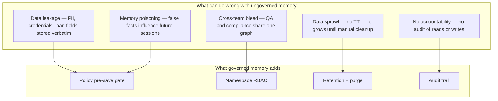

# 18 — Leadership Risk Brief: Official MCP Packages

**Audience:** engineering leadership, security, compliance, platform owners.  
**Read time:** 5 minutes.  
**Purpose:** Decide whether to allow agents to use Anthropic's official MCP packages directly — or require our governed memory pattern instead.

**Companion docs:**

| Doc | Use when |
|-----|----------|
| [16-playbook-mirror-privatize.md](./16-playbook-mirror-privatize.md) | Technical playbook: mirror tool surface, own governance |
| [05-data-retention-and-privacy.md](./05-data-retention-and-privacy.md) | Our retention and PII philosophy |
| [15-poc-demo.md](./15-poc-demo.md) | Live demo of governed memory for stakeholders |
| [14-operational-readiness.md](./14-operational-readiness.md) | Non-savable list, auth stages, namespace owners, production checklist |
| [17-governed-memory-landscape.md](./17-governed-memory-landscape.md) | How peers and production teams handle the same gap |

**Last updated:** 2026-07-15

---

## Executive summary

Anthropic publishes two packages teams often reach for when adding agent memory:

| Package | What it is | Leadership decision |
|---------|------------|---------------------|
| [`@modelcontextprotocol/sdk`](https://www.npmjs.com/package/@modelcontextprotocol/sdk) | Protocol library for building MCP servers and clients | **Approved** as a development dependency when we own what the server does |
| [`@modelcontextprotocol/server-memory`](https://www.npmjs.com/package/@modelcontextprotocol/server-memory) | Reference memory server — stores agent facts in a local text file | **Not approved for production agents** handling company, customer, or loan-adjacent data |

**Bottom line:** Using the SDK is normal infrastructure. Pointing production agents at vanilla `server-memory` is equivalent to giving every agent an unencrypted, ungoverned notebook that never expires — and letting it write whatever the model suggests.

This repo (`mcp-memory`) exists because that gap is real. We keep the same agent-facing tool names agents already know; we add policy, retention, namespaces, and audit underneath.

---

## The question leadership should ask

> *"If an agent pastes staging data, a stack trace, or a customer identifier into memory today, what stops it from being stored forever — and who can read it tomorrow?"*

| Answer with vanilla `server-memory` | Answer with governed memory (this repo) |
|-------------------------------------|----------------------------------------|
| Nothing stops it; data persists in a JSONL file until someone manually edits the file | Policy denies known PII/secret patterns **before** save |
| Any agent with MCP access can read, write, or delete the entire graph | Role + namespace RBAC; unknown namespace = deny |
| No record of who wrote what | Hash-chained audit log |
| No automatic expiry | Per-namespace TTL and scheduled purge |
| One shared graph for all use cases | Isolated namespaces (`qa`, `compliance`, etc.) |

---

## Risk overview (non-technical)

### Severity matrix

| Risk | Vanilla `server-memory` | `@modelcontextprotocol/sdk` alone | Governed pattern (MQM) |
|------|-------------------------|-----------------------------------|------------------------|
| PII / NPI persisted by agent mistake | **High** | N/A (SDK does not store data) | **Low** — deny patterns + synthetic IDs |
| Secrets in memory file | **High** | N/A | **Low** — pre-save scan |
| GDPR / retention compliance | **High** — no TTL or consent model | N/A | **Medium** — TTL + purge; tune per policy |
| Memory poisoning (bad facts stick) | **Medium** — no validation | N/A | **Medium** — policy + human Tier 2 for curated facts |
| Unauthorized read across teams | **High** — no RBAC | Depends on our server code | **Low** — namespace RBAC |
| No forensic trail after incident | **High** | Depends on our server code | **Low** — audit log |
| Supply chain / npm compromise | Low–medium (pin versions) | Same | Same |
| Disk exhaustion / abuse | **Medium** — no quotas ([upstream issue #4117](https://github.com/modelcontextprotocol/servers/issues/4117)) | N/A | **Low** — DB + operational limits |

---

## Package-by-package guidance

### `@modelcontextprotocol/sdk` — protocol library

**What it does:** Lets engineers wire tools, resources, and prompts between an AI host (Cursor, Claude Desktop) and a local or remote process. It is plumbing, not memory.

**Real risks (manageable):**

- **No built-in authentication** — whoever can start the MCP process gets whatever tools we registered. Acceptable for local dev; production HTTP deployments need our own auth.
- **We own the security boundary** — the SDK will execute any tool handler we write. Prompt injection that tricks the model into calling a delete or write tool is our problem to gate.
- **Supply chain** — standard npm dependency hygiene: pin versions, review upgrades, use lockfiles.

**Leadership stance:** Approve for building **our** MCP servers. The SDK is not the risk; **what our server stores and who can call it** is the risk.

**This repo:** `packages/mcp-server` uses SDK `1.29.0` (see [package-lock.json](../../package-lock.json)). We do not expose upstream `server-memory` to agents.

---

### `@modelcontextprotocol/server-memory` — reference memory server

**What it does:** Gives agents nine tools to build a knowledge graph (entities, relations, observations) persisted as a **single local JSONL file**. Anthropic documents it for cross-session chat personalization on a single machine.

**What it explicitly does not do:** PII scanning, retention, RBAC, audit, namespace isolation, encryption, or production hardening. Anthropic positions it as a **reference implementation**, not an enterprise memory product.

**Real risks (material for us):**

1. **Uncontrolled persistence** — Agents routinely summarize errors, URLs, and field values into `observations`. Without a pre-save gate, sensitive data becomes a permanent local archive.
2. **Compliance exposure** — Indefinite storage of personal or loan-adjacent data without documented retention, access control, or deletion workflow conflicts with how we treat QA and audit data ([05-data-retention-and-privacy.md](./05-data-retention-and-privacy.md)).
3. **Shared blast radius** — One file, one graph. A personalization experiment and a compliance workflow must not share the same memory store.
4. **Memory poisoning** — Adversarial or untrusted content in context can be written as "facts" and recalled in later sessions (documented MCP class of risk; see [Checkmarx MCP risk survey](https://checkmarx.com/zero-post/11-emerging-ai-security-risks-with-mcp-model-context-protocol/)).
5. **Destructive tools by default** — Delete operations require no confirmation; accidental or injected deletes are possible.
6. **Operational fragility** — Community and upstream discussion flag default path placement, non-atomic writes, and missing size quotas ([GitHub #4117](https://github.com/modelcontextprotocol/servers/issues/4117)).

**Leadership stance:**

| Scenario | Recommendation |
|----------|----------------|
| Individual engineer, local machine, no customer/staging data | Acceptable for **personal experimentation** with explicit file path outside repo |
| QA, mortgage staging, CI failures, compliance, or any team-shared agent | **Do not use vanilla `server-memory`** — use governed memory ([16-playbook-mirror-privatize.md](./16-playbook-mirror-privatize.md), this repo) |
| "We just want memory fast" | Fast path is **not** upstream package; it is our POC (`npm run smoke`, [15-poc-demo.md](./15-poc-demo.md)) |

---

## What we built instead (one slide)

| Capability | Vanilla `server-memory` | This repo |
|------------|-------------------------|-----------|
| Agent tool names | 9 KG tools | Same 9 tools + QA domain tools |
| Storage | Flat JSONL | SQLite with TTL |
| PII / secrets | None | `deny_patterns` in [mqm-policy.yaml](../../packages/policy/mqm-policy.yaml) |
| Who can write where | Anyone | Role + namespace RBAC |
| Retention | Manual file edit | Auto purge ([purge.ts](../../packages/shared/src/purge.ts)) |
| Audit | None | Hash-chained log |
| Tier 2 curated facts | N/A | Git PR only ([journeys/](../../journeys/)) |

Proof point for leadership: `npm run smoke` → **`SMOKE PASS`** (policy block, namespace deny, audit write). Demo script: [15-poc-demo.md](./15-poc-demo.md).

---

## Recommended policy decisions

### Approve

- `@modelcontextprotocol/sdk` in repos where **we implement and operate** the MCP server
- Governed memory MCP (`mortgage-qa-memory`) for QA and adjacent namespaces per [mqm-policy.yaml](../../packages/policy/mqm-policy.yaml)
- Local `server-memory` only under a **personal, non-production** exception with security acknowledgment

### Deny or require exception

- Pointing production or staging-connected Cursor agents at `@modelcontextprotocol/server-memory` without governance wrapper
- Storing memory files inside `node_modules`, project repos, or synced cloud folders
- Shared memory file across teams or environments

### Require before production rollout

See [14-operational-readiness.md](./14-operational-readiness.md) for the full checklist. Minimum:

- [ ] Interim non-savable list (§2) reviewed by compliance; patterns updated in [mqm-policy.yaml](../../packages/policy/mqm-policy.yaml)
- [ ] Namespace owners assigned (§4 worksheet); locked namespaces opened in policy
- [ ] [ai-inventory.yaml](../../ai-inventory.yaml) signed off (§6)
- [ ] Real staging CI wired (§5) if not local-only pilot
- [ ] SSO plan documented (§3) if moving to shared team server
- [ ] Audit retention and access path defined (who can run `get_audit_trail`)
- [ ] AI inventory entry updated ([ai-inventory.yaml](../../ai-inventory.yaml))
- [ ] Playbook communicated: **SDK yes, vanilla server-memory no** for regulated workflows

---

## FAQ for leadership

**Is Anthropic's package "unsafe" or malicious?**  
No. It is intentionally minimal — a teaching reference. The risk is **misusing a demo component as production infrastructure**.

**Can we wrap `server-memory` with our own policy later?**  
Possible, but we already implemented the mirror-and-govern pattern in this repo. Forking upstream buys little; owning the storage and gate is the work ([16-playbook-mirror-privatize.md](./16-playbook-mirror-privatize.md) §2).

**Does using the SDK mean our data goes to Anthropic?**  
No. stdio MCP runs locally. Data leaves the machine only if **our** server or agent sends it elsewhere.

**What would an incident look like?**  
Forensics find a `memory.jsonl` on a laptop containing SSN-shaped strings, staging URLs, or API keys — with no audit of who wrote them and no TTL. That is the scenario this brief is meant to prevent.

**What should we tell teams who already installed `server-memory`?**  
Migrate to governed MCP config ([cursor/mcp.json](../../cursor/mcp.json)), rotate any secrets that may have been stored, delete the old JSONL file, and document the exception if it was used with real data.

---

## References

- [Anthropic server-memory (npm)](https://www.npmjs.com/package/@modelcontextprotocol/server-memory)
- [MCP TypeScript SDK](https://github.com/modelcontextprotocol/typescript-sdk)
- [MCP architecture overview](https://modelcontextprotocol.io/docs/learn/architecture)
- [Upstream safer-defaults discussion (GitHub #4117)](https://github.com/modelcontextprotocol/servers/issues/4117)
- Internal: [16-playbook-mirror-privatize.md](./16-playbook-mirror-privatize.md), [17-governed-memory-landscape.md](./17-governed-memory-landscape.md)
