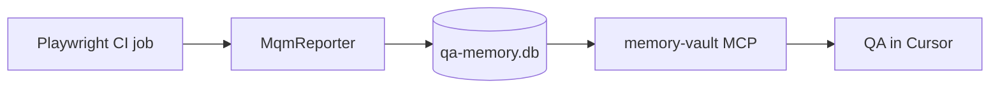

# Flow 2 — Playwright CI integration

Wire governed memory into a **consumer** Playwright repo so `get_flaky_tests` and triage tools use **real** staging runs (not `seed:demo`).

## Overview



## 1. Install reporter in your Playwright repo

From your Playwright project (not this repo):

```bash
# Option A: npm workspace file dependency (monorepo)
# package.json: "@mqm/reporter": "file:../naf-memory-vault/packages/reporter"

# Option B: copy packages/reporter + @mqm/shared until published
```

## 2. playwright.config.ts

```typescript
import { defineConfig } from "@playwright/test";
import MqmReporter from "@mqm/reporter";

export default defineConfig({
  reporter: [
    ["list"],
    [MqmReporter, {
      env: process.env.MQM_ENV ?? "staging",
      appId: process.env.MQM_APP_ID ?? "loan-origination-portal",
      loanScenarioId: process.env.MQM_LOAN_SCENARIO ?? "synthetic-retail-01",
    }],
  ],
});
```

## 3. Environment (CI job)

| Variable | Example | Purpose |
|----------|---------|---------|
| `MQM_DB_PATH` | `./data/qa-memory.db` | Shared SQLite path (artifact or mounted volume) |
| `MQM_POLICY_PATH` | `../naf-memory-vault/packages/policy/mqm-policy.yaml` | Policy pre-save |
| `MQM_ENV` | `staging` | Env tag on runs |
| `MQM_LOAN_SCENARIO` | `synthetic-retail-01` | Must be in policy allowlist |
| `CI_COMMIT_SHA` | `${{ github.sha }}` | Run correlation |

**Important:** Reporter never stores raw error text — only `error_class` + normalized signature.

## 4. Policy — staging URLs

Replace pilot placeholders in [`mqm-policy.yaml`](../packages/policy/mqm-policy.yaml):

```yaml
urls:
  allowed_prefixes:
    - https://your-staging.example
    - https://your-uat.example
```

Playwright MCP (optional repro) must use the same allowlist.

## 5. Point Cursor at the same DB

In `cursor/mcp.json` for the QA engineer:

```json
"MQM_DB_PATH": "./data/qa-memory.db"
```

Use the same path CI writes to (copy artifact locally, or shared team volume when gateway exists).

## 6. Triage workflow

1. CI fails → reporter writes Tier 1 row.
2. QA opens Cursor with `memory-vault-triage` skill.
3. Agent calls `get_failure_signature`, `should_skip_browser`, `get_test_history`.
4. If not known flake → optional Playwright MCP repro → `record_run_summary`.

## 7. Verify integration

```bash
# After a CI run with reporter enabled
npm run eval   # in naf-memory-vault — needs seeded signatures or real corpus
```

Pilot exit gate: triage ≥5 real staging failures via MCP ([q4-ci-triage.md](./rollout/q4-ci-triage.md)).

## Not in scope here

- Publishing `@mqm/reporter` to npm (internal registry TBD)
- Shared remote MCP server / SSO ([14-operational-readiness.md](./14-operational-readiness.md) §3)
