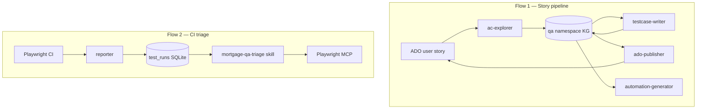

# QA Rollout — phased plan

**Audience:** QA lead, platform engineering, external pilot team.  
**Scope:** `qa` namespace only — story pipeline (Flow 1) and CI triage (Flow 2).  
**Status:** living plan — update feature doc `Status` fields as work completes.

**Principles:** [00-scope-and-principles.md](./00-scope-and-principles.md)

---

## Two flows

| Flow | Memory surface | Primary docs |
|------|----------------|--------------|
| **Flow 1** | KG entities (`US_{ID}_*`) in `qa` namespace | Q1–Q3 |
| **Flow 2** | `test_runs`, signatures, journeys, env facts | Q4, console |

---

## Phase map

| Phase | Duration | Umbrella | Exit gate | Owner |
|-------|----------|----------|-----------|-------|
| **Q1** | 4–6 wk | [q1-exploration-pilot.md](./q1-exploration-pilot.md) | `testcase-writer` drafts TCs from memory on ≥1 pilot story | QA lead + platform |
| **Q2** | 3–4 wk | [q2-story-pipeline.md](./q2-story-pipeline.md) | Explore → TCs in ADO, linked to story | QA lead |
| **Q3** | 3–4 wk | [q3-automation-and-assistant.md](./q3-automation-and-assistant.md) | Generated Playwright test; assistant answers locator Qs | QA + automation |
| **Q4** | 3–4 wk | [q4-ci-triage.md](./q4-ci-triage.md) | 5 real staging failures triaged; reporter feeding DB | QA + platform |
| **Q5** | ongoing | [q5-qa-hardening.md](./q5-qa-hardening.md) | `ai-inventory` signed; purge scheduled | Compliance + platform |

Q4 can overlap Q3 if a separate engineer owns CI reporter wiring.

---

## Feature index

### Q1 — Exploration memory pilot

| Doc | Feature |
|-----|---------|
| [q1-exploration-pilot.md](./q1-exploration-pilot.md) | Phase umbrella |
| [q1-ac-explorer-pilot.md](./q1-ac-explorer-pilot.md) | External QA `ac-explorer` on 2–3 stories |
| [q1-entity-schema-contract.md](./q1-entity-schema-contract.md) | `US_{ID}_*` entity shape |
| [q1-kg-console-read.md](./q1-kg-console-read.md) | Console KG browse (read-only) |
| [q1-staging-and-credentials.md](./q1-staging-and-credentials.md) | Policy URLs + `credential_ref` |

### Q2 — Story pipeline

| Doc | Feature |
|-----|---------|
| [q2-story-pipeline.md](./q2-story-pipeline.md) | Phase umbrella |
| [q2-testcase-writer.md](./q2-testcase-writer.md) | Manual TCs from exploration memory |
| [q2-ado-publisher.md](./q2-ado-publisher.md) | Publish TCs to ADO |
| [q2-tier2-locators.md](./q2-tier2-locators.md) | Durable locators via PR |

### Q3 — Automation + lookup

| Doc | Feature |
|-----|---------|
| [q3-automation-and-assistant.md](./q3-automation-and-assistant.md) | Phase umbrella |
| [q3-automation-generator.md](./q3-automation-generator.md) | Playwright C# from memory |
| [q3-qa-assistant.md](./q3-qa-assistant.md) | Read-only status / locator lookup |
| [q3-qa-profile.md](./q3-qa-profile.md) | Injected app/ADO/memory config |

### Q4 — CI triage

| Doc | Feature |
|-----|---------|
| [q4-ci-triage.md](./q4-ci-triage.md) | Phase umbrella |
| [q4-playwright-reporter.md](./q4-playwright-reporter.md) | CI → `test_runs` |
| [q4-triage-skill.md](./q4-triage-skill.md) | `mortgage-qa-triage` rollout |
| [q4-journeys.md](./q4-journeys.md) | Tier 2 journey YAML |
| [q4-unified-mcp-server.md](./q4-unified-mcp-server.md) | Single MCP entry point |

### Q5 — QA hardening

| Doc | Feature |
|-----|---------|
| [q5-qa-hardening.md](./q5-qa-hardening.md) | Phase umbrella |
| [q5-ai-inventory-signoff.md](./q5-ai-inventory-signoff.md) | LL-2026-04 inventory |
| [q5-purge-and-retention.md](./q5-purge-and-retention.md) | TTL enforcement |
| [q5-console-flow2-polish.md](./q5-console-flow2-polish.md) | Flake console on real data |

### Deferred

| Doc | Topic |
|-----|-------|
| [deferred-platform-and-namespaces.md](./deferred-platform-and-namespaces.md) | `pr`/`ops`/`compliance`, gateway SSO |
| [deferred-console-writes.md](./deferred-console-writes.md) | Governed delete/approve in UI |

---

## PLAN.md mapping

| Rollout | PLAN.md v3 |
|---------|------------|
| Q1 | Phase 3 (scoped: `ac-explorer` only) + console slice of Phase 2 |
| Q2–Q3 | Phase 3 (full agent pipeline) |
| Q4 | v2 POC gaps (NEEDS-ENV: real CI, staging triage) |
| Q5 | Phase 2 polish + operational readiness |
| Deferred | Phase 4–5 + namespace roadmap |

**Already done:** PLAN v3 Phase 1 (governed memory core) — `npm run smoke:graph`.

---

## Feature doc template

Every `q*-*.md` feature doc uses:

1. **Header** — Phase, Status, Owner, Flow, PLAN.md link  
2. **Problem** / **User story**  
3. **In scope / out of scope**  
4. **Dependencies**  
5. **Deliverables** (paths)  
6. **Acceptance criteria** (checkboxes)  
7. **Verification** (commands)  
8. **Open questions**  
9. **Related** (links to design docs)

---

## Related docs

| Doc | Use when |
|-----|----------|
| [PLAN.md](../../PLAN.md) | History and north star |
| [03-qa-automation-playwright.md](../03-qa-automation-playwright.md) | Playwright MCP |
| [07-mcp-tools-specification.md](../07-mcp-tools-specification.md) | Tool catalog |
| [14-operational-readiness.md](../14-operational-readiness.md) | Compliance gates |
| [cursor/qa-testing-agents/README.md](../../cursor/qa-testing-agents/README.md) | Agent pipeline |
